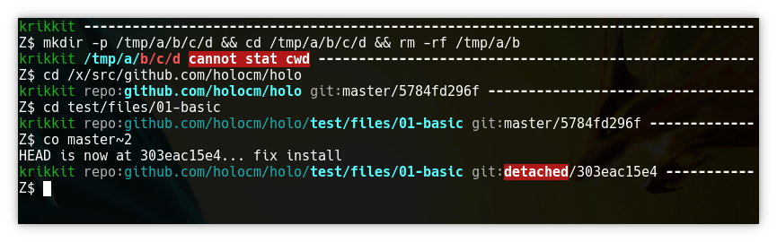

# Gofu

Gofu is a multibinary containing several utilities that I use everyday.

## What's with the name?

A gofu, [according to Wikipedia](https://en.wikipedia.org/wiki/Gofu), is a
type of household amulet or talisman, issued by a Shinto shrine, hung in the
house for protection.

Alternatively, the name can also be read as
"[Go](https://golang.org)-[fu](http://www.retrologic.com/jargon/F/suffix-fu.html)".

# List of applets

## `prettyprompt`

This renders my shell prompt. Among other things, it identifies the current
host by name and signature color (in the screenshot below, dark green for
Krikkit); highlights path elements inside a Git repo (if any) and path elements
that have been deleted; reports the current Git repo status; and reports the exit
code of the previous command (if it failed). It also heavily saves space where
possible, e.g. if the cwd starts with `$GOPATH/src/`, that is shortened to
`repo:`. A prefix of `$HOME/` is omitted entirely, as is my default user name.



## `rtree`

TODO: document

# Installation

```bash
$ make && make install
```
